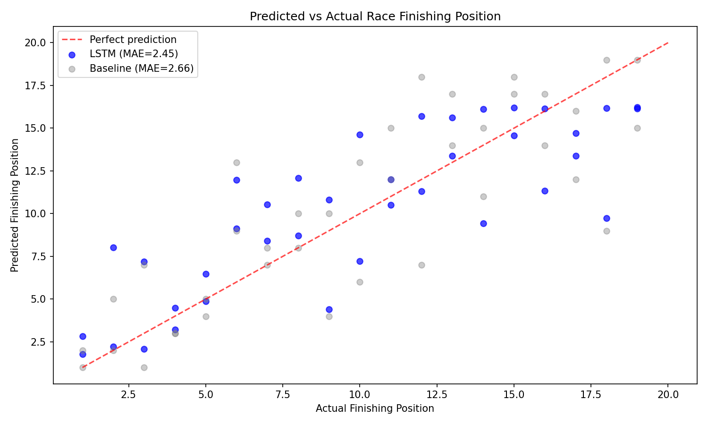
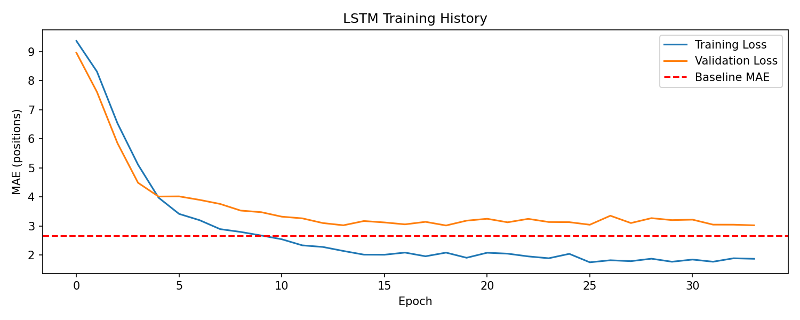

# 🏎️ F1 Race Outcome Forecasting with LSTM

> A deep learning model that predicts a driver's final race finishing position  
> using sequential lap telemetry from the first 15 laps of a race.


---

## 📌 Project Overview

In Formula 1, predicting where a driver will finish based on early race data is a genuine challenge — teams use live telemetry to make real-time strategic decisions. This project builds an LSTM (Long Short-Term Memory) neural network that watches the first 15 laps of a race and predicts each driver's final finishing position.

Unlike classical ML where each row is independent, this is a **sequence modelling problem** — the order of laps matters, and trends across laps carry more information than any single lap in isolation.

```
Input  → First 15 laps of telemetry per driver (sequence)
Output → Predicted final finishing position (1st–20th)
```

---

## 📊 Dataset

- **Source:** [FastF1 Python Library](https://github.com/theOehrly/Fast-F1) — official F1 telemetry API
- **Season:** 2023 Formula 1 World Championship
- **Races used:** 16 races (Bahrain through United States)
- **Total sequences:** 299 driver-race combinations
- **Sequence shape:** (299, 15, 6) — 299 samples × 15 timesteps × 6 features

| Split | Races | Sequences |
|-------|-------|-----------|
| Train | 14 races (Bahrain → Singapore) | 261 |
| Test  | 2 races (Britain + Italy)       | 38  |

### Why time-based splitting?
A random split would leak future race data into training — the model could train on Britain lap 40 while testing on Britain lap 20. Time-based splitting ensures the model only learns from past races and is evaluated on genuinely unseen future races, matching real-world deployment conditions.

---

## ⚙️ Feature Engineering

| Feature | Description | Rationale |
|---------|-------------|-----------|
| `LapTimeSeconds` | Lap time in seconds | Core pace indicator |
| `LapTimeDelta` | Current lap vs driver's race average | Detects performance trends and tyre degradation |
| `TyreLife` | Tyre age in laps | Strategy context — older tyres = slower pace |
| `Position` | Current race position each lap | Early race position trajectory |
| `LapsRemaining` | Laps left in the race | Race context window |
| `GridPosition` | Qualifying/starting position | Strongest prior for finishing position |

### Sequence Construction
Each training sample is a 3D tensor representing one driver's first 15 laps:

```
Shape: (15, 6)

         Feat1    Feat2    Feat3  Feat4  Feat5  Feat6
Lap 2  [ 86.4,   -0.5,    2.0,   1.0,   51.0,  1.0 ]
Lap 3  [ 86.1,   -0.8,    3.0,   1.0,   50.0,  1.0 ]
...
Lap 16 [ 87.1,   +0.4,   11.0,   2.0,   37.0,  1.0 ]

Target: 1.0  (driver finished 1st)
```

Sequences are built **before** `pick_quicklaps()` cleaning to preserve race context, then scaled with `StandardScaler` applied across the time dimension.

---

## 🧠 Model Architecture

```
Input: (15 timesteps, 6 features)
         ↓
LSTM Layer 1 (64 units, return_sequences=True)
         ↓        ← learns lap-by-lap patterns
Dropout (0.2)
         ↓
LSTM Layer 2 (32 units, return_sequences=False)
         ↓        ← compresses sequence to single vector
Dropout (0.2)
         ↓
Dense Layer (16 units, ReLU)
         ↓
Output Layer (1 unit)  ← predicted finishing position
```

**Total parameters:** 30,881 trainable  
**Why two LSTM layers?** The first layer learns low-level patterns (lap time trends, position changes). The second layer learns higher-level race narratives (consistent pace, strategic drops, recovery drives).  
**Why Dropout?** With only 261 training sequences, dropout prevents memorisation and forces the network to learn generalisable patterns.

### Training Configuration
```python
optimizer    : Adam
loss         : MAE (directly optimises the evaluation metric)
epochs       : 200 (with early stopping)
batch_size   : 16
patience     : 15 epochs
val_split    : 20% of training data
```

---

## 📈 Experiment Results

All experiments tracked with MLflow. Three systematic iterations:

| Experiment | Window | Features | Test MAE | Test RMSE | vs Baseline |
|------------|--------|----------|----------|-----------|-------------|
| Baseline (heuristic) | — | avg position | 2.66 | 3.91 | — |
| LSTM v1 | 10 laps | 5 features | 3.83 | 5.17 | ❌ worse |
| LSTM v2 | 10 laps | 6 features (+GridPos) | 3.05 | 3.80 | ⚠️ RMSE only |
| **LSTM v3 (final)** | **15 laps** | **6 features** | **2.45** | **3.14** | ✅ **both metrics** |

### Key findings from experiments
- **GridPosition was the single most impactful feature** — adding it reduced MAE by 0.78 positions in one step. Starting position is a strong prior for finishing position, especially in the first stint.
- **Window size of 15 > 10** — more laps give the model richer context about a driver's race trajectory before predicting the outcome.
- **LSTM v1 failed to beat baseline** — demonstrating that model complexity alone doesn't guarantee improvement. Feature quality and sufficient context matter more.

---

## 🏁 Final Model Performance

```
              Baseline    LSTM (final)    Improvement
────────────────────────────────────────────────────
MAE    :      2.66    →   2.45           ✅ +0.21 positions
RMSE   :      3.91    →   3.14           ✅ +0.77 positions
```

### Predicted vs Actual Finishing Position


Blue dots (LSTM) sit consistently closer to the perfect prediction line (red dashed) than grey dots (baseline), particularly for frontrunner positions P1–P5.

**Analytical observation:** Positions P1–P5 are predicted with significantly higher accuracy than P12–P20. Frontrunner positions are primarily determined by raw pace — which telemetry captures well. Midfield and backmarker positions are heavily influenced by pit strategy timing, safety cars, and reliability failures — factors not present in lap time data alone.

### Training History


Training loss crossed the baseline at epoch ~17 and continued improving. Validation loss stabilised around epoch 20, indicating the onset of mild overfitting — expected with 261 training samples. Early stopping restored the best weights automatically.

---

## 🔬 MLflow Experiment Tracking

All 3 experiments logged with parameters, metrics, and model artifacts.


```bash
# To view experiment history locally
mlflow ui \
--backend-store-uri sqlite:///mlflow.db \
--port 5000
# Open http://127.0.0.1:5000
```

---

## 🚀 How to Run

### 1. Clone the repository
```bash
git clone https://github.com/sudeep-07-hub/f1-race-forecasting.git
cd f1-race-forecasting
```

### 2. Install dependencies
```bash
pip install -r requirements.txt
```

### 3. Run the notebook
```bash
jupyter notebook notebook/lstm_model.ipynb
```

FastF1 downloads race data automatically on first run and caches locally. Full run takes approximately 10–15 minutes depending on internet speed.

---

## 📁 Project Structure

```
f1-race-forecasting/
│
├── notebook/
│   └── lstm_model.ipynb     ← full pipeline: data → sequences → LSTM → MLflow
│
├── assets/
│   ├── training_history.png ← train vs val loss curve
│   ├── pred_vs_actual.png   ← predicted vs actual positions
│   └── mlflow_dashboard.png ← experiment comparison screenshot
│
├── data/
│   └── f1_cache/            ← fastf1 local cache (gitignored)
│
├── mlruns/                  ← MLflow experiment logs (gitignored)
├── requirements.txt
└── README.md
```

---

## 📦 Requirements

```
fastf1==3.3.9
numpy==1.26.4
pandas>=2.0.0
tensorflow>=2.12.0
scikit-learn>=1.3.0
mlflow>=2.9.0
matplotlib>=3.7.0
jupyter
```

---

## 💡 Key Learnings

- **Sequential data requires sequence models** — a flat dense network ignores the temporal ordering of laps, which carries critical trend information
- **Feature engineering > model complexity** — adding GridPosition improved MAE by 0.78, more than any architectural change
- **Baselines are non-negotiable** — LSTM v1 failed to beat the heuristic baseline, proving that complexity doesn't automatically beat simplicity
- **Experiment tracking is professional practice** — MLflow makes it impossible to lose results and enables systematic comparison across runs
- **Honest evaluation matters** — reporting that v1 failed and showing the improvement path demonstrates genuine data science thinking, not result cherry-picking

---

## 🔮 Future Improvements

- **More seasons:** Expanding to 2019–2023 would provide 400+ sequences — expected to significantly reduce overfitting
- **Richer features:** Weather conditions, safety car probability, head-to-head teammate gap, tyre compound strategy
- **Attention mechanism:** Replace second LSTM with a self-attention layer — better at capturing which specific laps matter most for final position
- **Transformer architecture:** Positional encoding + multi-head attention has shown superior performance on sequence tasks with sufficient data
- **Live inference API:** Deploy as a FastAPI endpoint accepting live lap telemetry and returning position probabilities in real time